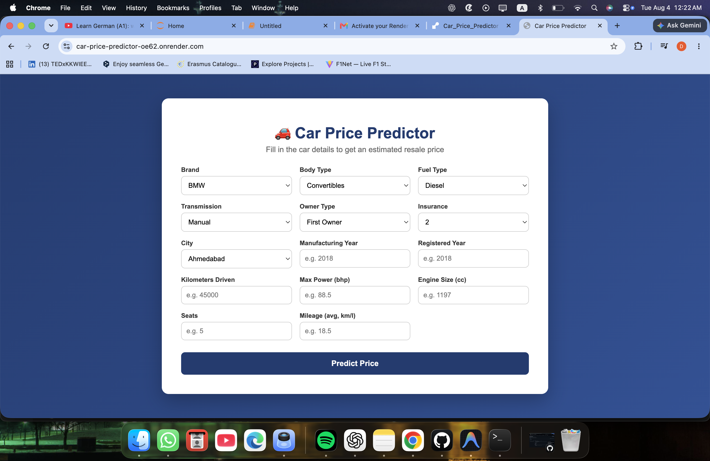
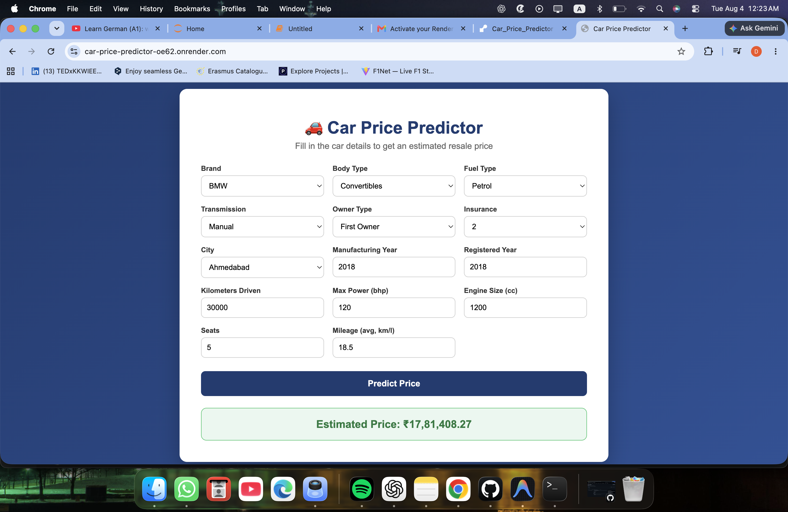

# 🚗 Car Price Predictor

<p align="center">
  
  
  
  
</p>

Predict the **resale price of used cars** using Machine Learning. The application uses a **Random Forest Regressor** trained on a real-world dataset and provides predictions through an interactive Flask web interface.

## 🌐 Live Demo

🔗 **https://car-price-predictor-oe62.onrender.com**

---

# 📖 Overview

Buying or selling a used car often requires estimating a fair resale value. This project leverages Machine Learning to predict the expected resale price based on vehicle specifications such as brand, manufacturing year, fuel type, transmission, engine size, mileage, owner history, insurance type, and more.

The trained model is deployed as a web application, allowing users to enter vehicle details and instantly receive an estimated resale price.

---

# ✨ Features

- 🚗 Predict used car resale prices
- 🤖 Machine Learning powered predictions
- 🌐 Responsive Flask web application
- 📊 Hyperparameter tuning using GridSearchCV
- 📈 Performance comparison across multiple regression models
- ☁️ Deployed on Render
- 💻 Hosted on GitHub

---

# 🧠 Machine Learning Workflow

```
Dataset
    │
    ▼
Data Cleaning
    │
    ▼
Feature Engineering
    │
    ▼
Encoding & Preprocessing
    │
    ▼
Train-Test Split
    │
    ▼
Model Training
    │
    ▼
GridSearchCV
    │
    ▼
Best Random Forest Model
    │
    ▼
Flask Web Application
    │
    ▼
Prediction
```

---

# 📂 Dataset

- **Source:** Kaggle
- **Records:** 17,063

### Input Features

- Brand
- Manufacturing Year
- Registration Year
- Kilometers Driven
- Engine Size
- Maximum Power
- Mileage
- Seats
- Fuel Type
- Body Type
- Transmission
- Insurance Type
- Owner Type
- City

---

# ⚙️ Data Preprocessing

The following preprocessing techniques were applied:

- Missing value handling
- Data cleaning
- Feature engineering
- One-Hot Encoding
- Feature selection
- Train-Test Split

---

# 🤖 Machine Learning Models

The following regression models were trained and compared.

| Model | R² Score | MAE | RMSE |
|------|---------:|---------:|---------:|
| Linear Regression | 0.6961 | 282,495 | 596,149 |
| Decision Tree (Tuned) | 0.8602 | 144,177 | 404,243 |
| ⭐ Random Forest (GridSearchCV) | **0.8823** | **117,872** | **371,015** |

**Final Model:** Random Forest Regressor

Hyperparameter tuning was performed using **GridSearchCV** to obtain the best-performing model.

---

# 🛠 Tech Stack

### Machine Learning

- Python
- Scikit-Learn
- Pandas
- NumPy
- Joblib

### Web Development

- Flask
- HTML5
- CSS3

### Deployment

- Render
- GitHub

---

# 📸 Screenshots

## Home Page




---

## Prediction



---

# 📁 Project Structure

```
Car_Price_Predictor/
│
├── app.py
├── requirements.txt
├── car_price_random_forest.pkl
├── car_resale_prices.csv
├── templates/
│   └── index.html
├── static/
│   └── style.css
├── README.md
└── Untitled.ipynb
```

---

# 🚀 Installation

Clone the repository

```bash
git clone https://github.com/DhawalDeshmukh72/Car_Price_Predictor.git
```

Move into the project

```bash
cd Car_Price_Predictor
```

Install dependencies

```bash
pip install -r requirements.txt
```

Run the Flask application

```bash
python app.py
```

Open your browser

```
http://127.0.0.1:5000
```

---

# 🌍 Deployment

The project is deployed on **Render**.

Live Website

https://car-price-predictor-oe62.onrender.com

---

# 📈 Future Improvements

- Explainable AI using SHAP
- Car image upload
- Model confidence score
- REST API
- Better feature engineering
- Advanced regression models (XGBoost, LightGBM)
- Interactive analytics dashboard

---

# 👨‍💻 Author

**Dhawal Deshmukh**

GitHub:
https://github.com/DhawalDeshmukh72

---

## ⭐ If you found this project helpful, consider giving it a star!